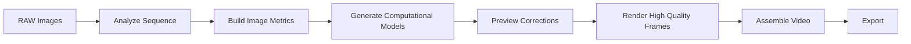

# HolyRail Architecture

HolyRail is designed around non-destructive image-sequence processing.

## Pipeline

## Non-Destructive State

Original images are never modified. Project files store frame references, analysis metrics, generated curves, and correction values. Rendered frames are created in separate output directories.

## Phase-One Algorithms

The initial implementation extracts luminance distributions, RGB channel means, and white-balance ratios. It builds smooth sequence curves using a Savitzky-Golay filter so short-term frame variation can be reduced while long-term scene evolution remains intact.

## Project Docs

- [Architecture](architecture.md)
- [RAW Metadata Validation](raw-validation.md)
- [Backlog](../BACKLOG.md)
- [Sprint Plan](../SPRINTS.md)
